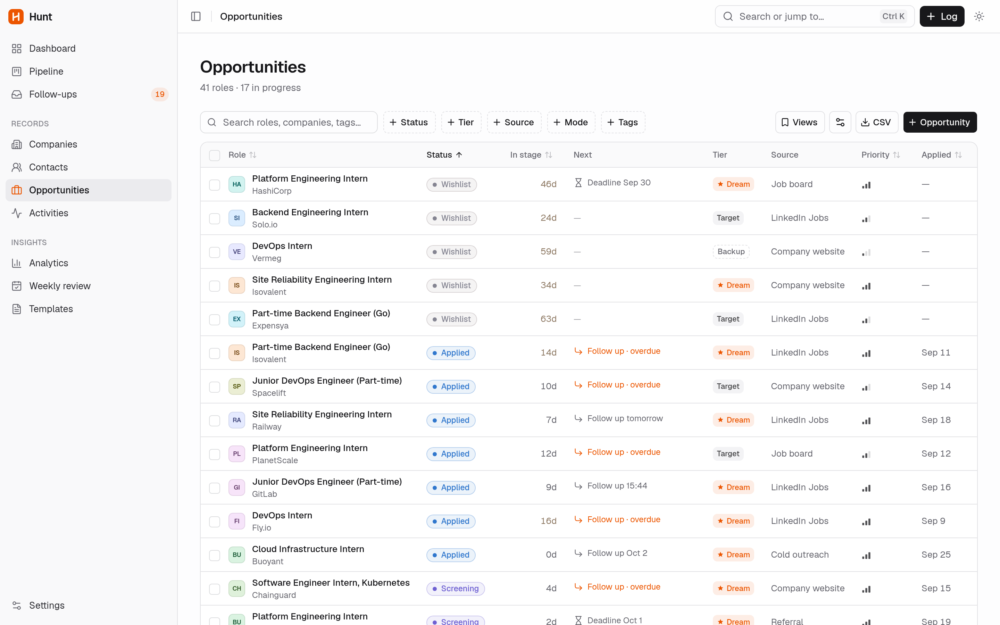

<div align="center">


# Hunt

**A local-first CRM for your internship and job search.**

Log every application, cold email, LinkedIn DM and follow-up in seconds, never miss a follow-up, and see what's actually working.


<br />

<picture>
  <source media="(prefers-color-scheme: dark)" srcset="docs/screenshots/dashboard-dark.png" />
  <source media="(prefers-color-scheme: light)" srcset="docs/screenshots/dashboard-light.png" />
  
</picture>

</div>

---

## Why Hunt?

A real job search is hundreds of small touchpoints across company sites, LinkedIn, email and referrals. Spreadsheets fall apart around the third follow-up. Hosted CRMs are built for sales teams and want your data in their cloud.

Hunt is built for a single person looking for work:

- **Fast to log.** One key opens a form: `A` for an application, `E` for a cold email, `L` for a LinkedIn DM. Companies and contacts are created inline as you type.
- **It remembers so you don't have to.** Every outreach gets a follow-up reminder based on your rules, and threads that go quiet are marked as ghosted automatically.
- **Honest analytics.** Reply rates, funnel conversion and time to first reply, with clear definitions, and a flag when a number is based on too little data to trust.
- **Your data stays yours.** No accounts, no cloud, no telemetry. Everything lives in one SQLite file on your machine.

## Features

| | |
| --- | --- |
| **Dashboard** | Daily goal rings, streaks, an activity heatmap, today's follow-ups and upcoming interviews |
| **Pipeline** | Kanban board (Applied → Interview → Offer → Rejected) with drag and drop that follows the status rules and records history |
| **Companies, contacts, opportunities** | Sortable, filterable tables with saved views, detail pages and a full activity timeline |
| **Quick log and command palette** | Keyboard-first logging, plus `Ctrl K` search across everything, including notes and job descriptions |
| **Follow-up engine** | Per-type reminder rules, follow-ups linked to the original message, snoozing, and ghosting after a configurable number of days |
| **Analytics** | Outreach volume, reply rate by channel and by template, funnel conversion, stage durations and time to first reply |
| **Weekly review** | Your week against your weekly goals, with notes on what to change next week |
| **Templates** | Reusable cold emails, DMs, connection notes and follow-ups |
| **Guardrails** | Warnings for duplicate companies and roles, a nudge if you messaged a contact in the last 7 days, the company's local time, and a LinkedIn weekly connection meter |
| **Calendar feed** | An `.ics` feed of interviews, deadlines and follow-ups to subscribe to from any calendar app |
| **Import and export** | CSV import and export for tables, full JSON backup and restore, raw database download, and automatic daily snapshots |
| **Runs where you are** | Desktop app (Electron), a PWA on your phone over your LAN, or a plain browser tab |
| **Themes** | Light, dark or system, with no flash on load |

## Screenshots

<table>
  <tr>
    <td width="50%"><p align="center"><b>Pipeline</b>: drag cards between stages</p></td>
    <td width="50%"><p align="center"><b>Analytics</b>: see what's actually working</p></td>
  </tr>
  <tr>
    <td width="50%"><p align="center"><b>Follow-ups</b>: everything that's due, in one inbox</p></td>
    <td width="50%"><p align="center"><b>Opportunities</b>: filter, sort and save views</p></td>
  </tr>
</table>

<sub>Screenshots use the built-in sample data (<code>npm run db:seed</code>).</sub>

## Quick start

**Requirements:** Node.js 20.9 or newer (tested on Node 24).

```bash
git clone https://github.com/ahmedharabi/Hunt-CRM.git hunt
cd hunt
npm install
npm run db:migrate   # creates ./data/hunt.db (also runs automatically on server start)
npm run db:seed      # optional: ~40 companies and 3 months of sample activity
npm run dev          # http://localhost:3000
```

The sample data is tagged, so you can remove it later without touching your own entries: run `npm run db:seed -- --clear`, or use **Settings → Data**.

## Ways to run it

### Desktop app (Linux)

```bash
npm run desktop:install    # builds, then adds Hunt (with its icon) to your app launcher
```

Search for "Hunt" in your launcher and pin it to your dock. It opens in its own window and uses the same `./data/hunt.db`.

- Run `desktop:install` again after changing code, so the build is current.
- `npm run desktop` launches it from a terminal.
- `npm run desktop:uninstall` removes the launcher. Your data is not touched.
- Server logs are in `~/.config/Hunt/server.log`.

The Electron shell starts Hunt's production server on a free local port using your system Node, so the native SQLite module never needs rebuilding for Electron.

### Docker

```bash
docker compose up -d --build                     # http://localhost:3000
APP_PASSWORD=pick-something-long docker compose up -d --build   # with a login screen
```

Data is stored in the `hunt-data` volume (mounted at `/data`), so rebuilding or updating the image keeps it. Migrations run automatically on start.

### On your phone

```bash
npm run dev:lan      # or: npm run build && npm run start:lan
```

Open `http://<your-computer's-LAN-IP>:3000` on your phone (same Wi-Fi) and choose **Add to Home Screen**. The PWA manifest makes it open like a native app.

### Password protection

Hunt has no login screen by default. To require a password (recommended with `dev:lan` or `start:lan`), set it in `.env.local`:

```bash
APP_PASSWORD=pick-something-long
```

## Keyboard shortcuts

| Key | Action |
| --- | --- |
| `A` / `E` / `L` / `C` / `F` | Log an application, cold email, LinkedIn DM, connection request or follow-up |
| `/` or `Ctrl K` | Command palette: search everything or run an action |
| `Ctrl Enter` | Submit the open form or dialog |
| `Ctrl B` | Toggle the sidebar |

## How it works

### Automation

- Logging an application creates the opportunity, or moves an existing one forward.
- Logging an interview moves the opportunity to Interviewing.
- A positive reply *offers* to move Applied → Screening. It never changes status silently.
- Silent threads and stalled roles are marked as ghosted after your threshold (checked when the dashboard loads).
- Every status change is written to status history, which the funnel analytics read.

### Metric definitions

- **Outreach**: outbound activities that start a thread. Follow-ups, interviews and notes don't count as new outreach.
- **Reply rate**: threads with at least one inbound reply ÷ outreach threads, grouped by the original send date.
- **Time to first reply**: first reply − original send, per thread.
- **Funnel conversion**: opportunities that ever reached stage N+1 ÷ those that ever reached stage N, from status history. Skipping a stage counts as passing it.
- **Stage duration**: time between consecutive status-history entries.
- Sample data is left out as soon as you have real activity, and metrics based on fewer than 5 data points are flagged.

### Your data

| Path | Contents |
| --- | --- |
| `./data/hunt.db` | The database (SQLite, WAL mode) |
| `./data/backups/` | A snapshot on the first request each day (the last 14 are kept) |
| `./data/uploads/` | Uploaded resumes |

`./data` is gitignored. Set `HUNT_DATA_DIR` to keep it somewhere else.

## Tech stack

- **Framework:** [Next.js 16](https://nextjs.org) (App Router, Server Components, Server Actions), React 19, TypeScript (strict)
- **Database:** SQLite via [better-sqlite3](https://github.com/WiseLibs/better-sqlite3) and [Drizzle ORM](https://orm.drizzle.team)
- **UI:** [Tailwind CSS 4](https://tailwindcss.com), [shadcn/ui](https://ui.shadcn.com), [lucide](https://lucide.dev) icons, [next-themes](https://github.com/pacocoursey/next-themes)
- **Data and interaction:** [TanStack Table](https://tanstack.com/table), [dnd-kit](https://dndkit.com), [cmdk](https://cmdk.paco.me), [Recharts](https://recharts.org)
- **Forms and validation:** [react-hook-form](https://react-hook-form.com) and [Zod](https://zod.dev), with the same schemas shared by forms and server actions
- **Desktop:** [Electron](https://www.electronjs.org)
- **Testing:** [Vitest](https://vitest.dev) against in-memory SQLite

## Project structure

```
app/                 routes (App Router); (app)/ holds everything behind the sidebar
components/ui/       shadcn/ui primitives
components/layout/   sidebar, header, providers
components/shared/   app-level building blocks (badges, avatars, page shell)
components/…         forms, data-table, detail, dashboard, pipeline, analytics, settings
db/                  schema, client, migrations, seed, backups
electron/            desktop shell (main process)
lib/domain.ts        enums, status transitions, default goals and rules: the single source of truth
lib/meta.ts          labels, icons and colors per status and activity type
lib/services/        business rules, analytics, dashboard, review, backup (pure functions that take a db)
lib/actions/         server actions: validate with Zod, call a service, revalidate
lib/queries/         server-only reads for pages
scripts/             desktop install script
tests/               Vitest suites
```

## Scripts

| Script | What it does |
| --- | --- |
| `npm run dev` / `dev:lan` | Dev server (`dev:lan` binds to `0.0.0.0`) |
| `npm run build` / `start` / `start:lan` | Production build and server |
| `npm run desktop` / `desktop:install` / `desktop:uninstall` | Run, install or remove the desktop app |
| `npm run db:generate` | Generate a migration after editing `db/schema.ts` |
| `npm run db:migrate` | Apply pending migrations |
| `npm run db:seed` | Load sample data. Refuses if you already have real data; use `-- --force` to add anyway, or `-- --clear` to remove all sample rows |
| `npm run db:studio` | Drizzle Studio, a GUI for the database |
| `npm test` | Run the test suite |
| `npm run check` | Typecheck, lint, test and build |

## Contributing

Contributions are welcome: bug reports, ideas and pull requests.

1. Fork the repo and create a branch: `git checkout -b my-feature`
2. Make your change. Business rules belong in `lib/services/` (pure and testable), and status rules in `lib/domain.ts`.
3. If you change `db/schema.ts`, run `npm run db:generate` and commit the migration.
4. Make sure `npm run check` passes.
5. Open a pull request describing what changed and why.

For larger changes, please open an issue first so we can agree on the approach.

## License

[MIT](LICENSE)
